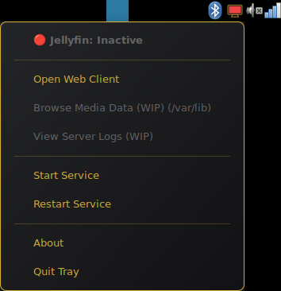
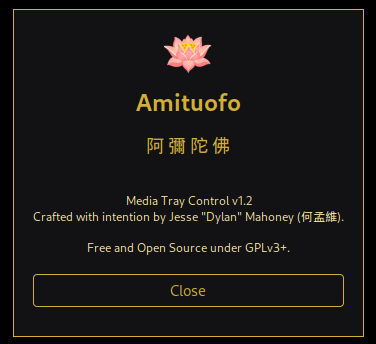

# Media Tray Control

> *"Programming is 10% elegant architecture, and 90% staring at a blinking cursor wondering why the daemon hates you today. Build it clean, keep it free, and let the code speak for itself." ~JDM*

Amituofo.

[](https://github.com/monway/media-tray-control/actions/workflows/build-deb.yml)
[](LICENSE)


> ### 💬 A Note from the Developer
> 
> While this is an official release, I am still actively exploring options for future builds. I see what users want, and I am paying attention, just give me time. 
> 
> Right now, the project compiles cleanly, the core features work as intended, and the architecture is stable. Polishing code and refining features will remain ongoing until I finally step back and walk away, but for now, **this build is good as is**.
> 
> If you find value in this project, please share it, talk about it, and encourage others to build with or adapt the code. All I ask is that you attribute my name respectfully. 
> 
> Thank you for your interest and support in my corner of the net. *Sharing is caring.*
> 
> **Jesse "Dylan" Mahoney (何孟維)**

## Visual Preview

| Tray Menu Interface | About Dialog |
| :---: | :---: |
|  |  |

---

## Features

- **Auto-Detection:** Automatically detects native systemd service (`jellyfin.service`) or Flatpak container (`org.jellyfin.JellyfinServer`).
- **Event-Driven:** Uses GIO D-Bus signal subscriptions instead of active polling (0.0% idle CPU).
- **Zero-Password Control:** Direct integration with systemd via PolicyKit rules without requiring passwords.
- **Lightweight:** Minimal memory footprint (<15 MB RSS).
- **Non-Blocking:** Responsive GTK3 / AyatanaAppIndicator interface.

- **Phase 2 Development (WIP):** Menu options for "Browse Media Data" and "View Server Logs" are currently visible in the UI but intentionally disabled. These features are strictly under construction, pending state handling and security code reviews before activation.

## Security & Privileges

- **Polkit Integration:** Uses a scoped JavaScript PolicyKit rule (`10-media-tray-control.rules`) restricted exclusively to `jellyfin.service`.
- **No Sudoers Modification:** Zero `/etc/sudoers.d/` overrides, preserving standard Linux privilege boundaries and user-space security.

## Installation & Dependencies (Debian/Ubuntu)

Install dependencies:
```bash
sudo apt install python3-gi python3-gi-cairo gir1.2-gtk-3.0 gir1.2-ayatanaappindicator3-0.1
```

Install binary, Polkit rule, and desktop launcher:
```bash
sudo install -m 0644 10-media-tray-control.rules /etc/polkit-1/rules.d/
sudo install -m 755 media-tray-control /usr/local/bin/media-tray-control
sudo install -m 644 media-tray-control.desktop /usr/share/applications/
```

... ( Optional ) ... Enable automatic startup on desktop login:
```bash
mkdir -p ~/.config/autostart
cp media-tray-control.desktop ~/.config/autostart/
```

## Cross-Distribution Support

This tool supports multiple package formats and service types, making it compatible across various Linux distributions:
- **Native Systemd:** Fully integrated with native systemd services on Debian/Ubuntu-based systems.
- **Flatpak Support:** Automatically detects and controls Jellyfin Server running inside a Flatpak container (`org.jellyfin.JellyfinServer`).

## Uninstallation

```bash
sudo rm -f /usr/local/bin/media-tray-control \
           /etc/polkit-1/rules.d/10-media-tray-control.rules \
           /usr/share/applications/media-tray-control.desktop
rm -f ~/.config/autostart/media-tray-control.desktop
```

## License

Copyright (C) 2026 Jesse Dylan Mahoney (何孟雄)

---

### Trademark Notice & Non-Affiliation
Media Tray Control is an independent open-source utility crafted by Jesse "Dylan" Mahoney. This project is not affiliated with, endorsed by, or connected to the official Jellyfin project or its contributors. All product names, logos, and brands are property of their respective owners.
